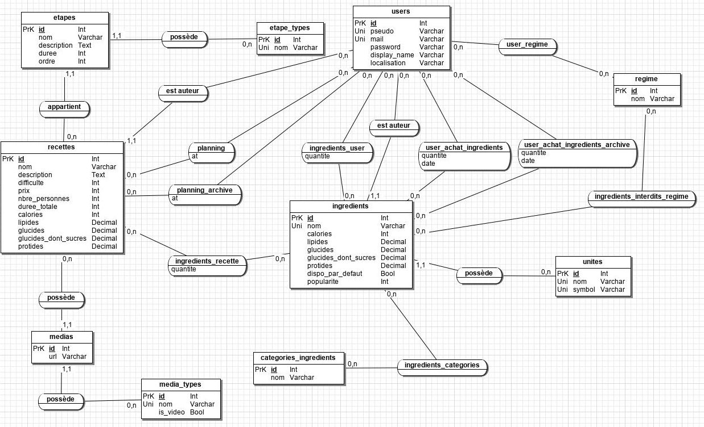
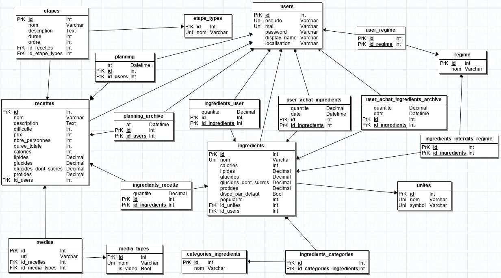

# Introduction

Dans le cadre de l'UE de base de données et programmation web de la troisième
année de licence d'informatique à l'Université de Strasbourg, il nous a été
demandé de réaliser la conception d'un site de recettes complet, c'est-à-dire
la base de données qui contiendra l'ensemble des données du site (utilisateurs
enregistrés, recettes, ingrédients, ...) ainsi que le site à proprement parler.

Ce présent rapport concerne uniquement la première partie de ce travail : de la
modélisation et la conception à la réalisation même de la base de données.

\newpage

# Modélisation

## Modèle entité-association

Voici le modèle entité-association de la base de données du site de recette de
cuisine, qui respecte les besoins fonctionnels indiqués dans l'énoncé :

Du coup pourquoi ces choix ? Place aux justifications !

Voici les tables que je considère comme des tables principales :

### Table `users`

Cette table contiendra l'ensemble des utilisateurs du site.

Voici les champs que je considère utile pour cette table :

  - `id` : la clé primaire, chaque utilisateur pourra donc être identifié
    avec un numéro unique.
  - `pseudo` : utile pour se connecter, pourra être changé (vu que toutes
    les références à l'utilisateur seront pointés vers son `id`), doit être
    unique.
  - `mail` : contiendra l'adresse mail : utile pour le joindre par exemple
    (doit être unique)
  - `password` : mot de passe chiffré de l'utilisateur
    (stockage du résultat du chiffrement avec bcrypt par exemple, réalisé
    du côté applicatif)
  - `display_name` : utile pour que l'utilisateur puisse personnaliser son
    nom d'affichage s'il le souhaite, avec son nom et prénom par exemple.
    (peut être vide; pour les requêtes à faire, on admet que si ce champ est
    renseigné, il contient le nom et le prénom de la personne).
  - `localisation` : pour indiquer sa région, sa ville ou bien son adresse;
    comme bon lui semble (peut être vide; surtout utile pour les requêtes par la
    suite quand on souhaitera avoir l'`adresse` de l'utilisateur).

Il se peut qu'on ait besoin d'ajouter un champ pour indiquer si le compte a déjà
été activé ou non, ainsi que d'autres informations éventuels sur l'utilisateur;
mais cela se fera lors de la création du site web.

Peut-être voir aussi pour un champ pour indiquer s'il s'agit ou non d'un
compte administrateur, pour donner des permissions plus importantes.

### Table `unites`

Cette table contiendra les différentes unités possibles pour les ingrédients.
Pourquoi se contenter d'une table et non d'un simple champ supplémentaire dans
la table contenant les ingrédients ? Je justifie ce choix par un soucis de
faciliter l'ajout de nouvelles unités et donc de faire des `<select>` dynamiques
en html en se basant sur les différentes unités présentes dans cette table.
Dans le sujet il n'était demandé de ne traiter les ingrédients que par grammes
ou par unité; je trouve ce choix beaucoup trop restreint, car on ne peut par
exemple pas travailler avec des litres, et cela est bien dommage. Passer par
cette table permet vraiment de s'assurer de toujours proposer aux utilisateurs
les différentes unités, sans avoir à changer le code html manuellement.

Les champs que devra contenir cette table :

  - `id` : pour référencer l'unité dans la table `ingredients`
  - `nom` : pour donner un nom à l'unité, ex : *Gramme* (doit être unique)
  - `symbol` : pour donner le symbole correspondant à cette unité,
    ex : *g* (doit être unique)

On pourra imaginer par exemple une unité *sans unité* de `symbol` vide (`NULL`)
qui servira à représenter les ingrédients à l'unité.

### Table `ingredients`

Cette table servira à stocker l'ensemble des ingrédients utilisables.

Les champs nécessaires pour cette table sont les suivants :

  - `id` : numéro unique servant à identidier l'ingrédient
  - `nom` : nom de l'ingrédient
  - `calories` : un entier représentant le nombre de calories
  - `lipides` : un décimal représentant la quantité de lipides
  - `glucides` : un décimal représentant la quantité de glucides
  - `glucides_dont_sucres` : un décimal représentant la quantité de sucre
  - `protides` : un décimal représentant la quantité de protides
  - `dispo_par_defaut` : par défaut vaut `false` (ou `0`); permet de savoir si
    on peut     considérer que cet ingrédient est toujours disponible chez un
    utilisateur lambda (ex : le sel, le poivre, l'eau, ...), dans ce cas ce
    champ vaut `true` (ou `1`)
  - `popularite` : à chaque recherche par ingrédient avec cet ingrédient, on
    incrémente sa valeur (au départ à 0); cette valeur est réinitialisé chaque
    mois à 0.

Les valeurs nutritionnelles seront renseignées par unité, comme ça il n'y
aura plus qu'à multiplier la quantité par les valeurs pour trouver les valeurs
finales pour la recette.

### Table `categories_ingredients`

Cette table permet de stocker les différentes catégories d'ingrédients, dans
le but de remplacer un ingrédient par un autre qui lui est équivalent (donc
appartient à la même catégorie) si besoin dans une recette.

Les champs suivants sont requis :

  - `id` : un identifiant unique pour la catégorie d'ingrédient
  - `nom` : le nom de la catégorie

### Table `regime`

Cette table permet de stocker les différents régimes possibles, et devra être
composé des champs suivants :

  - `id` : identifiant unique servant à faire référence à un régime particulier
  - `nom` : le nom de ce régime (ex : *sans gluten*, *végétarien*, ...)

### Table `recettes`

Cette table est l'une des tables principales du projet. En effet, c'est elle
qui contiendra l'ensemble des recettes disponibles sur le site.

Elle devra être composé des champs suivants :

  - `id` : numéro unique permettant de référer la recette ailleurs
  - `nom` : nom de la recette (par forcément unique, car plusieurs façons
    possibles de faire la même recette)
  - `description` : description de la recette (pas forcément besoin d'être
    renseigné, donc peut être vide)
  - `difficulté` : entier de 1 à 5 indiquant la difficulté :
    - 1 : Très facile
    - 2 : Facile
    - 3 : Intermédiaire
    - 4 : Difficile
    - 5 : Très difficile
  - `prix` : un entier de 1 à 5 indiquant le prix :
    - 1 : Gratuit
    - 2 : Pas cher du tout !
    - 3 : Prix correct
    - 4 : Un peu cher
    - 5 : Pour une très grande occasion : prix élevé
  - `nbre_personnes` : un entier indiquant le nombre de personnes pour qui a
    été prévu cette recette; mais pourra toujours être adapté côté applicatif.
  - `duree_totale` : un entier, représentant la durée totale en minutes pour
    effectuer cette recette.
  - `calories` : un entier représentant le nombre de calories
  - `lipides` : un décimal représentant la quantité de lipides
  - `glucides` : un décimal représentant la quantité de glucides
  - `glucides_dont_sucres` : un décimal représentant la quantité de sucre
  - `protides` : un décimal représentant la quantité de protides

J'ai ajouté *Très difficile* dans les difficultés par soucis de symétrie. Dans
le sujet il était question d'aller jusqu'à *Difficile* uniquement.

Les valeurs nutrionnelles concerneront l'ensemble de la recette.

Peut être voir pour ajouter un champ qui indique si la recette est publiée
de manière publique sur le site ou si elle est encore en stade de brouillon;
à voir lors de la conception du site web.

### Table `etapes`

Cette tables contiendra l'ensenble des étapes à suivre pour réaliser une
recette, et devra posséder les champs suivants :

  - `id` : l'identifiant unique de l'étape (ne changera jamais)
  - `nom` : nom de l'étape (ex: *Cuire les œufs*)
  - `description` : décrit l'étape plus en détail si besoin (ex : *placer les
    œufs dans la casserole, allumer le feu et patientez 5 minutes*), peut être
    laissé vide.
  - `duree` : la durée de l'étape en minutes
  - `ordre` : utile si l'on souhaite réorganiser l'ordre des étapes d'une
    recette; au final il n'y aura plus qu'à ordonner par ce champ pour avoir
    la recette dans le bon ordre

### Table `etape_types`

Cette table permet de stocker les différents types d'étapes, par exemple
*Cuisson*, *Préparation*, ...

Cette table nécessite les deux champs suivants :

  - `id` : identifiant unique pour y faire référence depuis `etape`
  - `nom` : le nom de cette étape

### Table `medias`

Cette table liste les différents médias (photos, vidéos, ...) disponibles pour
les recettes.

Elle nécessite les champs suivants :

  - `id` : identifiant unique du média
  - `url` : l'url vers le média en question

### Table `media_types`

Cette table liste les différents types de média disponibles (photo, vidéo
YouTube, vidéo Dailymotion, ...). L'avantage est que l'on peut ajouter
rapidement dans la liste un nouveau service de vidéos qui viendrait de sortir
par exemple.

Elle nécessite les champs suivants :

  - `id` : identifiant unique du type de média
  - `nom` : le nom du type de média (ex : *Photo*, *Vidéo YouTube*, ...)
  - `is_video` : un boolean; si `true` (ou `1`), alors il s'agit d'une vidéo,
    sinon il s'agirait plutôt d'une photo.

\newpage

## Contraintes d'intégrité

Voici les contraintes d'intégrité que devront respecter le modèle :
(tous les `id` doivent être non vides et uniques dans chacune des tables)

### Table `users`

  - `pseudo` doit être unique et non vide, longeur maximale : 25 caractères
  - `mail` doit être unique et non vide, doit contenir le caractère suivant :
    `@`, précédé et suivi d'au moins un caractère. (on pourrait pousser ceci
    beaucoup plus loin, mais je préfère effectuer ces vérifications côtés
    applicatif directement), longeur maximale : 255 caractères
  - `password` doit être non vide

### Table `unites`

  - `nom` doit être unique et non vide
  - `symbol` doit être unique, mais peut être vide (cas des ingrédients pris par
    unité)

### Table `ingredients`

  - `nom` doit être unique et non vide
  - `calories` doit être supérieur ou égal à zéro
  - `lipides` doit être supérieur ou égal à zéro
  - `glucides` doit être supérieur ou égal à zéro
  - `glucides_dont_sucres` doit être supérieur ou égal à zéro
  - `protides` doit être supérieur ou égal à zéro
  - `popularite` doit être supérieur ou égal à zéro

### Table `categories_ingredients`

  - `nom` doit être unique et non vide

### Table `regime`

  - `nom` doit être unique et non vide

### Table `recettes`

  - `nom` doit être non vide (pas forcément unique, car plusieurs manière de
    faire la même recette)
  - `difficulte` un entier compris entre 1 et 5
  - `prix` un entier compris entre 1 et 5
  - `nbre_personnes` un entier strictement positif
  - `duree_totale` un entier strictement positif
  - `calories` doit être supérieur ou égal à zéro
  - `lipides` doit être supérieur ou égal à zéro
  - `glucides` doit être supérieur ou égal à zéro
  - `glucides_dont_sucres` doit être supérieur ou égal à zéro et inférieur ou
    égal à la valeur du champ `glucides`
  - `protides` doit être supérieur ou égal à zéro

### Table `etapes`

  - `nom` non vide
  - `duree` doit être supérieur ou égal à zéro (zéro en cas d'étapes vraiment
    rapides, ex : *prenez les oœufs*)

### Table `etape_types`

  - `nom` doit être unique et non vide

### Table `medias`

  - `url` doit être non vide

### Table `media_types`

  - `nom` doit être unique et non vide

\newpage

## Liens entre les tables

Dans cette partie nous verrons les différents liens entre les tables, les
cardinalités, et les tables de jonctions qu'il faudra encore créer.

Donc tout d'abord, un utilisateur peut s'inscrire. Il peut être l'auteur de 0
à n recettes, et une recette a été écrite par un seul et unique utilisateur.

Une recette est composée de 0 (dans le cas où la recette viendrait d'être crée,
et pas encore publiée) à n étapes, et une étape appartient à une seule et unique
recette.

Une étape possède un seul et unique type d'étape, et un type d'étape peut
appartenir à 0 ou n étapes différentes.

Une recette possède de 0 à n médias, et un média appartient impérativement à une
seule et unique recette.

Un média possède un et un seul type de média, et un type de média peut contenir
de 0 à médias différents.

Une recette peut être dans 0 à n planning d'utilisateur, tout comme un planning
d'utilisateur peut contenir de 0 à n recettes; il faut donc créer une table de
jonction, `planning`, dans laquelle en plus des références vers l'utilisateur
et la recette, je mets un champ de type date que j'appelle `at` pour dire quand
est-ce que la recette est programmée dans le planing de l'utilisateur. Ce champ
devra respecter la contrainte du fait que sa valeur ne doit pas être dans plus
d'un mois, et que si la date est dépassée, on doit déplacer l'élément dans 
la table `planning_archive` qui est identique à celle-ci, sauf sans les
contraintes sur le champ `at`.

Une recette est composé de 0 à n ingrédients (0 dans le cas d'une recette non
publiée, qui vient d'être crée par exemple), et un ingrédient peut être
utilisé par 0 à n recettes; il faut donc une table de jonction, que j'appelle
`ingredients_recette`, dans laquelle j'ai, en plus des références vers les `id`
de recette et ingrédient, un champ décimal `quantite`, qui me permet de stocker
la quantité de cet ingrédient qu'il faut pour la recette.

Un ingrédient peut appartenir à 0 à n catégories, et une catégorie peut
contenir 0 à n ingrédients; je créer donc une table de jonction
`ingredients_categories` qui contiendra les références vers les `id` des
ingrédients et de leurs catégories.

Chaque ingrédient est exprimé selon une et une seule unité stockée dans la
table `unite`, et une unité est utilisée par 0 à n ingrédients. Il faut donc
créer une référence dans la table `ingredients` qui pointe vers le champ `id`
de la table `unite`.

Un ingrédient est ajouté par un seul et unique utilisateur, et un utilisateur
peut ajouter de 0 à n ingrédients; c'est donc la raison pour laquelle j'ai
ajouté un champ `auteur` à la table `ingredients` qui pointe vers le champ `id`
de la table `users`, dans le but d'identifier l'auteur de l'ingrédient.

Chaque utilisateur peut avoir 0 à n ingrédients chez lui, et un ungrédient peut
être possédé par 0 à n utilisateurs; je créé donc une table de jonction
`ingredients_user`, avec les références vers les `id` de l'utilisateur et
de l'ingrédient, ainsi qu'un champ `quantite` qui servira à stocker la quantité
de l'ingrédient en question que possède l'utilisateur.

Idem pour les listes d'achats, sauf que je mets en plus un champ qui contient
la date à laquelle l'ingrédient a été ajouté à la liste d'achat; cette date
ne peut pas être dans plus d'un mois et inférieure à aujourd'hui. La même table
pour les archives ne contiendra juste pas les contraintes sur la date.

Enfin, pour finir, un régime peut concerner de 0 à n utilisateurs, un
utilisateur peut avoir 0 à n régimes; il faut donc créer une table de jonction
que j'appelle `user_regime` dans laquelle se trouve simplement les références
vers les `id` de l'`user` et du `regime`. Et un régime peut interdir un certain
nombre d'ingrédients, tout comme un ingrédient peut être interdit par 0 à n
régimes; je créé donc une table de jonction `ingredients_interdits_regime`, avec
les références vers le régime et l'ingrédient.

\newpage

## Modèle logique relationnel

Voici le modèle logique relationnel de la base, construit sur la base du modèle
entité-asociation vu précédemment :

Un modèle un peu plus précis pour les références pointées (clés étrangères) créé
avec l'aide de [DBDesigner](https://dbdesigner.net/) est disponible dans le
dossier `images` de l'archive. Cependant, du fait qu'il soit trop large et
également moins lisible, j'ai préféré uniquement inclure dans ce rapport la
version que vous voyez là, et laissé en libre consultation l'autre modèle
en-dehors de ce rapport.

\newpage

# Précisions

Il se peut que j'ai changé le nom de certains champs, changé le type de clé,
ajouté des contraintes supplémentaires, ... directement dans le code par rapport
à ce qui se trouve dans ce présent rapport. Veuillez vous référer au code.

# Programmes utilisés

Pour illustrer proprement mes modèles, j'ai pris la décision d'utiliser 
[JMerise](http://www.jfreesoft.com/JMerise/).

J'ai également utilisé [DBDesigner](http://dbdesigner.net) pour avoir un schéma
plus complet, qui se trouve dans le dossier `images`. Je ne l'ai pas joint
dans ce rapport car il y aurait des soucis de lisibilité sinon.

Pour générer ce rapport, j'ai utilisé `pandoc` pour convertir mon rapport
rédigé au format Markdown en latex, dans le but de l'exporter en pdf.
